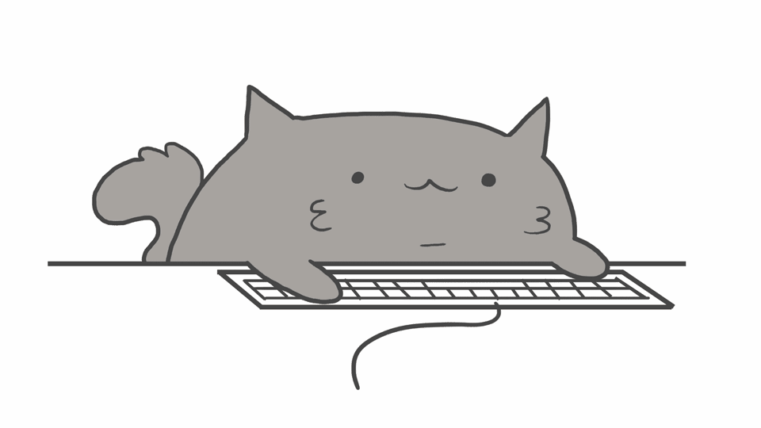

# Hi there 

### I'm a FrontEnd Development. Nice to have you on my page! 

 

## My stats 
----

 

 

## My skills 
----

  &nbsp;
 &nbsp;
  &nbsp;
  &nbsp;
  &nbsp;
  &nbsp;
  &nbsp;
  &nbsp;
  &nbsp;
  &nbsp;
  &nbsp;

 

 

